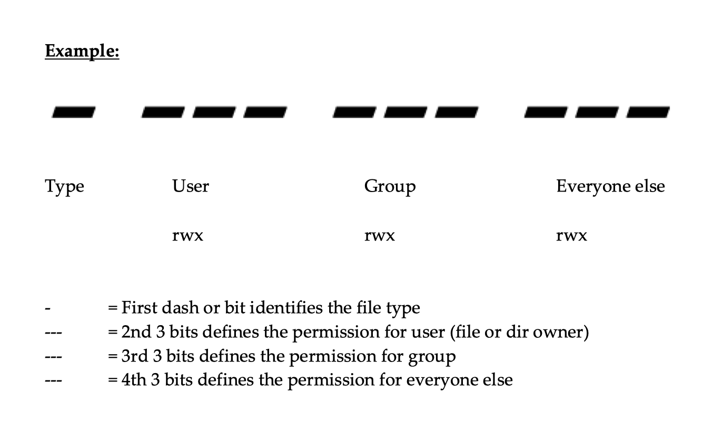

# File Permissions

- UNIX is a multi-user system. Every file and directory in your account can be protected from or made accessible to other users by changing its access permissions. Every user has responsibility for controlling access to their files.
- Permissions for a file or directory may be restricted to by types.
- There are 3 types of permissions:

  - `r`: read
  - `w`: write
  - `x`: execute = running a program
- Each permission (`rwx`) can be controlled at three levels:

  - `u`: user = yourself
  - `g`: group = can be people in the same project
  - `o`: other = everyone on the system
- File or Directory permission can be displayed by running `ls –l` command:

  ```
  -rwxrwxrwx
  ```
- Command to change permission:

  ```
  chmod
  ```

<p align="center">
  
</p>

Permissions can also be changed through the numerical method. Each of the permission types is represented by either a numeric equivalent:

- read=4, write=2, execute=1

or a single letter:

- read=r, write=w, execute=x

A permission of 4 or r would specify read permissions. If the permissions desired are read and write, the 4 (representing read) and the 2 (representing write) are added together to make a permission of 6. Therefore, a permission setting of 6 would allow read and write permissions.

### Table


| Number | Permission           |
| -------- | ---------------------- |
| 0      | None                 |
| 1      | Execute              |
| 2      | Write                |
| 3      | Write, Execute       |
| 4      | Read                 |
| 5      | Read, Execute        |
| 6      | Read, Write          |
| 7      | Read, Write, Execute |

## Common Options

- `-f`: force (no error message is generated if the change is unsuccessful)
- `-R`: recursively descend through the directory structure and change the modes

## Examples

If the permission desired for file1 is user: read, write, execute, group: read, execute, other: read, execute, the command to use would be:

```bash
chmod 755 file1
```

or

```bash
chmod u=rwx,go=rx file1
```

Reminder: When giving permissions to group and other to use a file, it is necessary to allow at least execute permission to the directories for the path in which the file is located. The easiest way to do this is to be in the directory for which permissions need to be granted:

```bash
chmod 711 .
```

or

```bash
chmod u=rw,+x .
```

or

```bash
chmod u=rwx,go=x .
```

where the dot (.) indicates this directory.

# File Ownership

## chown - change ownership

Ownership of a file can be changed with the chown command. On most versions of Unix this can only be done by the super-user, i.e. a normal user can’t give away ownership of their files. chown is used as below, where # represents the shell prompt for the super-user:

Syntax:

```bash
chown [options] user[:group] file (SVR4) 
```

or

```bash
chown [options] user[.group] file (BSD)
```

### Common Options

- `-R`: recursively descend through the directory structure
- `-f`: force, and don’t report any errors

## Examples

```bash
# chown new_owner file
```

## chgrp - change group

Anyone can change the group of files they own, to another group they belong to, with the chgrp command.

Syntax:

```bash
chgrp [options] group file
```

### Common Options

- `-R`: recursively descend through the directory structure
- `-f`: force, and don’t report any errors

## Examples

```bash
% chgrp
```

# Access control list

## List of commands for setting up ACL:

1. To add permission for a user:
   ```
   setfacl -m u:user:rwx /path/to/file
   ```

2. To add permissions for a group:
   ```
   setfacl -m g:group:rw /path/to/file
   ```

3. To allow all files or directories to inherit ACL entries from the directory it is within:
   ```
   setfacl -dm "entry" /path/to/dir
   ```

4. To remove a specific entry (for a specific user):
   ```
   setfacl -x u:user /path/to/file
   ```

5. To remove all entries (for all users):
   ```
   setfacl -b /path/to/file
   ```

**Note:**
- As you assign the ACL permission to a file/directory, it adds a "+" sign at the end of the permission.
- Setting write permission with ACL does not allow to remove a file.


